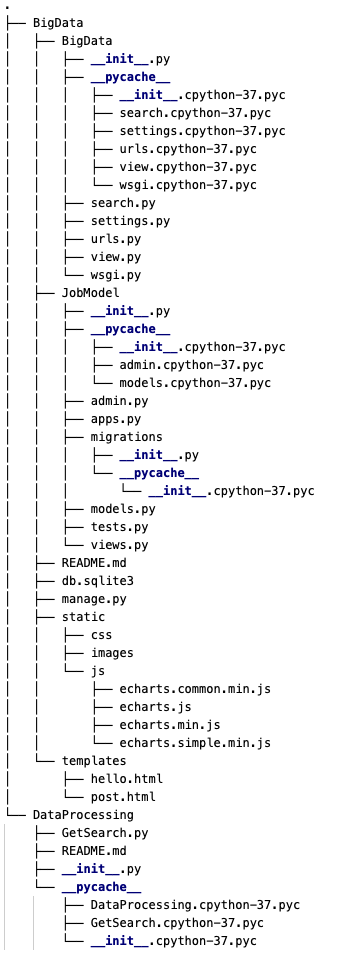

## Django模块-1.0

0. 运行环境：  
    name | version
     - | -
    python | 3.7.4
    django | 2.2.7
    pymysql | 0.9.3  
    numpy | 1.17.3  
    pandas | 0.25.3 

1. 操作：  
    + 创建MySQL数据库：例：job
    + 进入../BigData/BigData/setting.py修改数据库信息；
    + 进入终端导航到cd ../BigData目录下；
    + 运行命令1：python manage.py makemigrations；
    + 运行命令2：python manage.py migrate；
    + 设置PyCharm：Edit Configurations->选项Parameters->填写：runserver 0.0.0.0:8000；
    + 运行：../BigData/manage.py；

2. 目录结构：   
    
