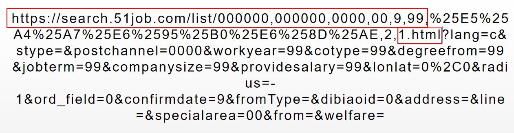

# Spider51job
爬取代理ip->爬取51job->清洗->存入MySQL
# 爬虫使用文档  
## 1.本地建立数据库 
确保你有安装好MySQL数据库  
windows下打开使用win+R搜索cmd，打开命令行  
cd 到项目目录下，我的是G:\IDEA_Project\Spider_v1.1  
windows切换磁盘先打G: 然后再cd 路径  
> cd G:\IDEA_Project\Spider_v1.1

保证前面的路径已经成功改为项目的位置
启动mysql  
> mysql -uroot -p  

运行脚本  
> mysql> source databaseDDL.sql
出现一下结果为成功
```
Query OK, 1 row affected, 1 warning (0.01 sec)

Query OK, 1 row affected, 1 warning (0.00 sec)

Database changed
Query OK, 0 rows affected, 30 warnings (0.00 sec)

Database changed
Query OK, 0 rows affected, 10 warnings (0.00 sec)
```

可以通过show databases;查看数据库的建立  
可以通过use [数据库名]; 然后 show tables; 查看表的建立

## 2.启动项目（使用IDEA，Eclipse自行对应）
确保电脑安装了maven 3.6+ ,Java 1.8+   
使用idea启动项目   
0）在根目录下(与src同级)新建一个data文件夹。   
1）确保File->Settings->Editor->File Encodings都是UTF-8，以及With NO BOM   
2）然后在src->main->java->resource->db-config下修改userName和passwd为你的Mysql的用户名和秘密。  
如果是远程数据库修改上面的address中的两个localhost为你的ip地址即可  
3）Main函数，右键Run "Main.main()"启动或者ctrl+shift+f10启动，然后静静等待就行

## 3.注意事项
1）默认设置是爬取400页代理ip，会被西刺代理封24小时，所以，要么修改GlobalConfiguration中相关参数，要么一天最多爬一次，不然只会清空代理ip的数据库  
2）resource->51job-jobnamekeyword中url，红框1是统一的，红框1和红框2之间是根据关键字的来定的，红框2是页数以及html协议，红框2以后全部都可以不用，
所以要添加新的关键字的话，对应的url是选择红框2前面的所有字符就行，页数以及html这些会在程序里面加上的

