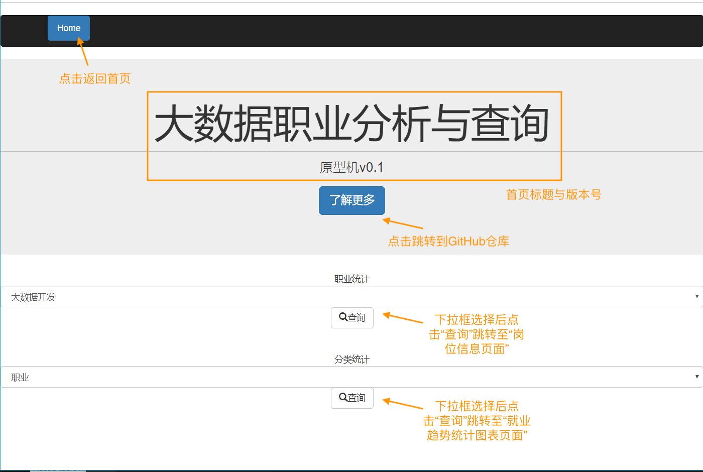
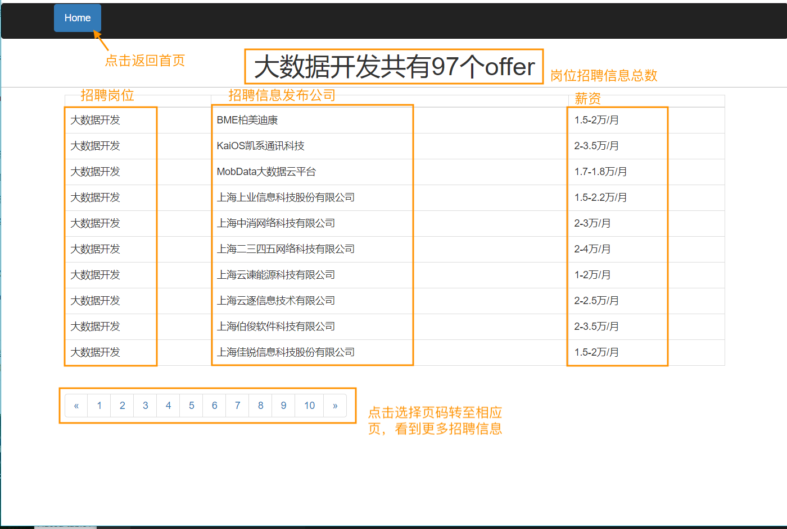
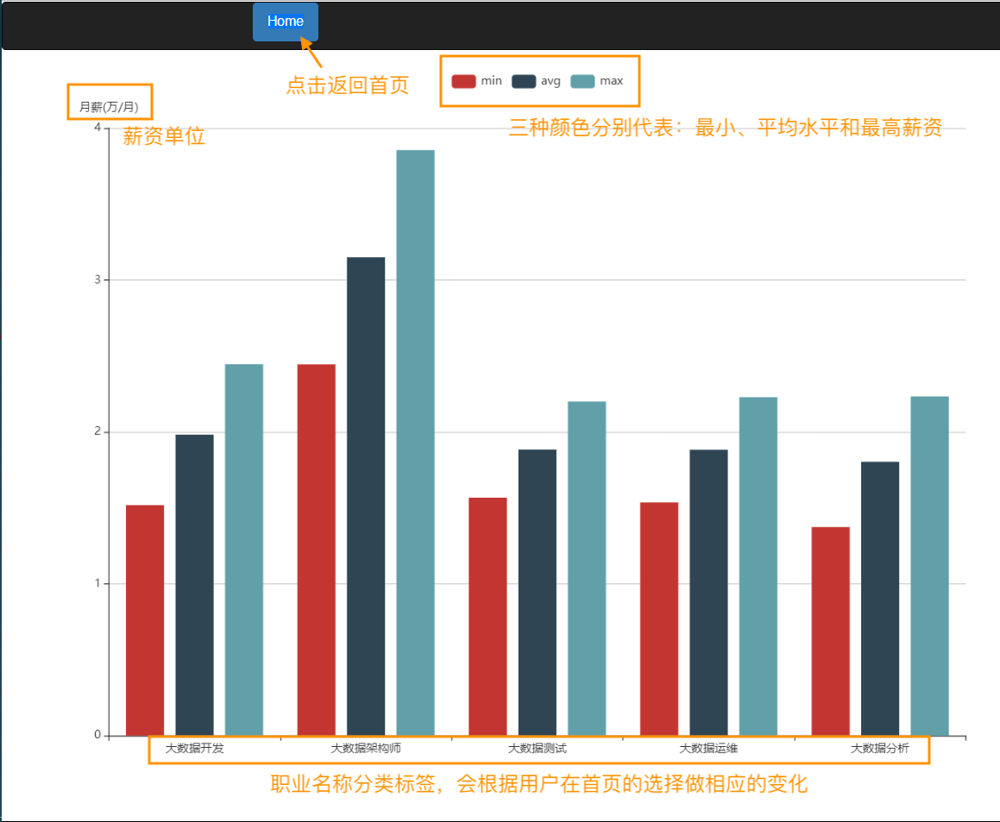

# "一个月完成项目"——前端开发文档

---

| 修订日期   | 版本 | 修订内容     | 修订人 | 审核人 |
| ---------- | ---- | ------------ | ------ | ------ |
| 2019-11-29 | v1.0 | 前端详细设计 | 李翼   | zzj    |


- ["一个月完成项目"——前端开发文档](#一个月完成项目前端开发文档)
  - [1. 前端概述](#1-前端概述)
  - [2. 概要设计](#2-概要设计)
  - [3. 前端模块设计](#3-前端模块设计)


##  1.测试环境：

   

   + 使用外部库：Bootstrap3.3.7,jquery-3.4.1,Echarts
            

## 2. 概要设计

1. 前端流程设计  
    ```mermaid
        graph LR;
            A[大数据职业分析与查询网-首页]--搜索职业名-->B[岗位信息页面];
            A--搜索就职条件-->C[薪水统计图表页面];
            B-.返回首页.->A;
            C-.返回首页.->A;
    ```
2. 前端业务逻辑
    + 大数据职业分析与查询网-首页
        + 界面示例展示  
            示例: 
        + 操作指南：
            &ensp; &ensp; &ensp; &ensp; 用户点击进入["大数据+上海"就业信息网-首页]，浏览首页展示网站基本信息；
            &ensp; &ensp; &ensp; &ensp; 在首页第一个下拉框内可选择“大数据开发”、“大数据运维“、”大数据架构师“，”大数据测试“和”大数据分析“五个选项，可任意选择一个然后点击“查询”，则进入[岗位信息页面]，查看所选职业的详细招聘信息;
            &ensp; &ensp; &ensp; &ensp; 在首页第二个下拉框内可选择“职业”、“教育背景“、”工作经验“，”公司类型“，“地区”和”公司领域“六个选项，可任意选择一个然后点击“查询”，则进入[就业趋势统计图表页面]，查看所选关键字影响下的就业趋势统计图表。

    + 岗位信息页面
        + 界面示例展示  
            示例: 
        + 操作指南：
            &ensp; &ensp; &ensp; &ensp; 查看所选职业的招聘信息总数和详细资料，包含职位名称、招聘公司和薪资待遇；
            &ensp; &ensp; &ensp; &ensp; 点击上方导航栏的“Home按钮即可返回首页；
            &ensp; &ensp; &ensp; &ensp; 点击下方数字列表可展现指定页码的职业信息。

    + 就业趋势统计图表页面
        + 界面示例展示  
            示例: 
        + 操作指南：
            &ensp; &ensp; &ensp; &ensp; 查看所选关键字影响下的就业趋势统计图表，点击上方导航栏的“Home”按钮即可返回首页。

## 3. 前端详细设计

1. base.html
    + 界面名称：大数据职业分析与查询网-首页
    
    + 功能：浏览首页展示基本信息，用户可选择提交搜索表单任一到服务器；
    
    + 内部逻辑：
        ```mermaid
        graph LR;
            A[用户]--浏览-->B[base.html];
            B-.提交岗位信息表单.->C[服务器:get_jobinfo模块];
            D[jobinfo.html]--返回到主页-->B;
            C-.岗位信息数据.->D;
            B-.提交职业/教育背景等关键字表单.->E[服务器:get_group_statistics模块];
            F[stats.html]--返回到主页-->B;
            E-.统计图绘制数据.->F;
        ```
    
    + 组件说明：
      
      	+ 导航栏组件：

          + 功能：返回首页按钮
          + URL：/home
          + HTTP请求方式：GET
       
        + 岗位信息搜索组件：
            + 功能：提交分类统计关键字表单到服务器，并根据URL来提供特定的服务。
            + URL: /{{job}}/{{page}}
            + HTTP请求方式：POST
        + 分类统计关键字搜索组件：
            + 功能：提交分类统计关键字表单到服务器，并根据URL来提供特定的服务。
            + URL: /stats
            + HTTP请求方式：POST


2. jobinfo.html 
    + 界面名称：岗位信息页面
    + 功能：解析服务器:get_jobinfo模块传来的数据查看所选职业的详细招聘数据，并将其展示到界面，点击左上角返回按钮即可返回首页。
    + 内部逻辑：
        ```mermaid
        graph LR;
            A[用户]--进入-->B[base.html];
            B-.提交岗位信息表单.->C[服务器:get_jobinfo模块];
            B--进入-->D[jobinfo.html];
            C-.解析岗位信息数据.->D;
            D[form.html]--返回-->B;
        ```
    + 组件说明：
        + 导航栏组件：
            + 功能：返回首页按钮
            + URL：/home
            + HTTP请求方式：GET
        + 表格组件：
            + 功能：显示职业信息。
            + HTTP请求方式：GET


3. stats.html 
    + 界面名称：就业趋势统计图表页面
    + 功能：解析服务器:get_group_statistics模块传来的数据，利用Echarts绘制用户所需统计图。查看所选关键字影响下的就业趋势统计图表，点击左上角返回按钮即可返回首页。
    + 内部逻辑：
        ```mermaid
        graph LR;
            A[用户]--进入-->B[base.html];
            B-.提交职业/教育背景等关键字表单.->E[服务器:get_group_statistics模块];
            B--跳转-->F[stats.html];
            E-.解析统计图绘制数据.->F;
            F[stats.html]--返回-->B;
        ```
    + 实现方式：
        + Echarts 
    + 组件说明：
        + 导航栏组件：
            + 功能：返回首页按钮
            + URL：/home
            + HTTP请求方式：GET
        + Echarts统计图组件：
            + 功能：解析数据，绘制统计图
            + HTTP请求方式：GET


