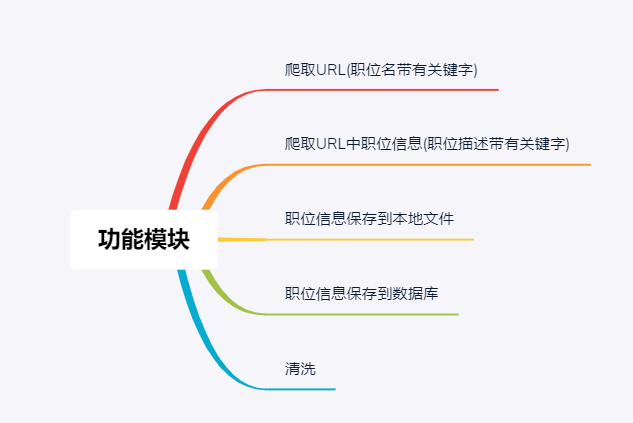
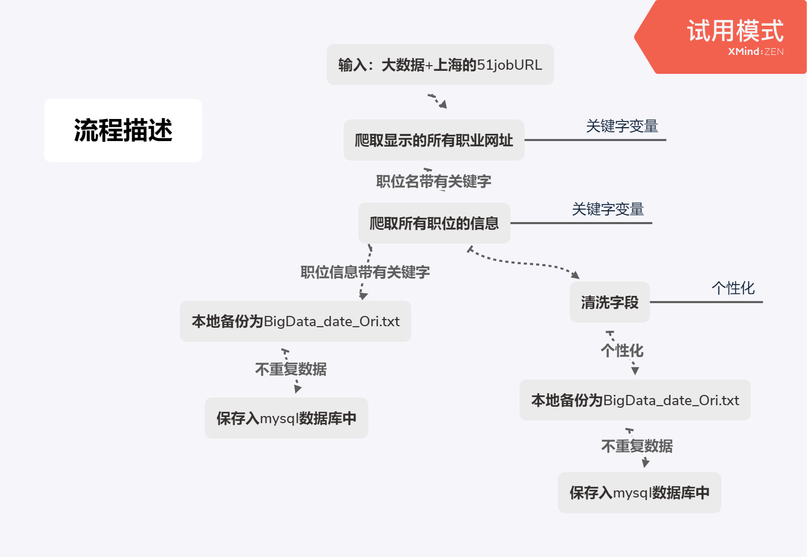

# SpiderJob1.0概要设计文档  
## 1.设计概述
### 1.1限制和约束
开发环境:  
* Java 1.7+  
* Maven 3.6.1+  
* UTF-8字符集
### 1.2设计原则和设计要求
* 变量为驼峰命名，函数为帕斯卡命名法
* 模块低耦合且灵活性高
* 数据库设计，Innodb引擎，utf-8字符集。
## 2.系统逻辑设计
### 功能模块大致设计

### 流程描述

2019-11-24 zzj