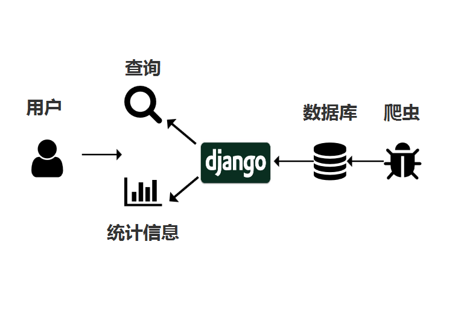
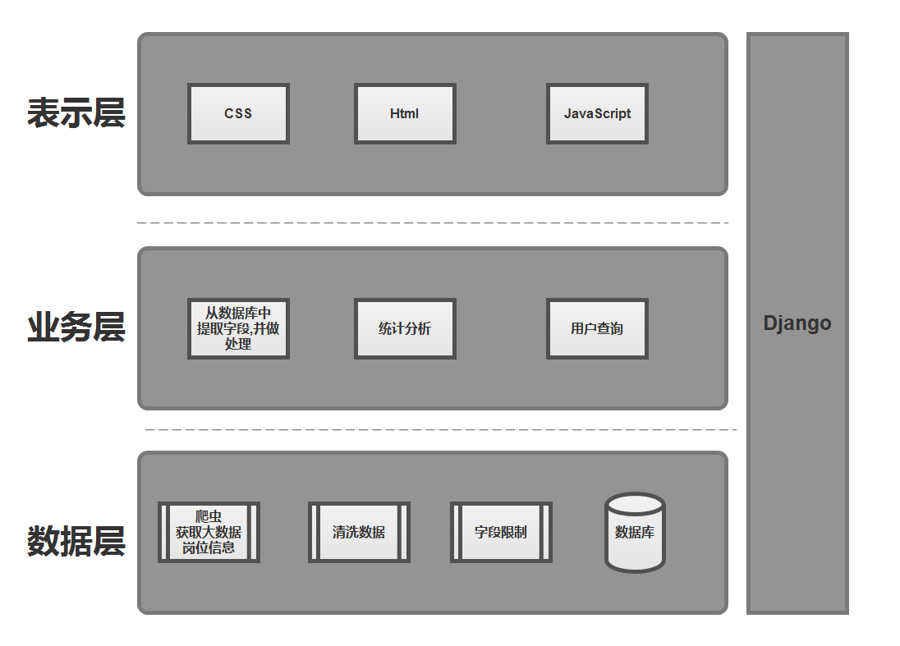

# ***“一个月完成项目！开发文档 ”***

***

> 励志成为一个孤独而坚定的践行者.
>
> ​												————江峰

| 修订日期   | 版本              | 修订内容                             | 修订人 | 审核人 |
| ---------- | ----------------- | ------------------------------------ | ------ | ------ |
| 2019/11/06 | v0.01(旧版本写法) | 建立初步的需求分析                   | 刘若尘 | zzj    |
| 2019/11/22 | v0.02(旧版本写法) | 确定模块功能概要                     | 刘若尘 | zzj    |
| 2019/11/28 | v1.0              | 模块功能改进,前端内容加入            | 刘若尘 | zzj    |
| 2020/1/19  | v1.1              | 增加了浏览器的环境说明，增加新的应用 | 刘若尘 |        |

[TOC]

# 1.前言

## 1.1目的

​	该文档给出项目的整体结构和功能结构，试图从总体架构上给出系统的轮廓。同时对功能需求进行了详细的描述。方便给予开发人员和设计人员进行交流和理解，同时作为项目工作进行下去的基础和依据。

​	本文档面向读者:

(1)设计人员

(2)开发人员

(3)部署维护人员

## 1.2背景

​	现在的社会是一个高速发展的社会，科技发达，信息流通，人们之间的交流越来越密切，生活也越来越方便，大数据就是这个高科技时代的产物。紧跟时代的步伐，通过对广大学生提供相关职业的信息，为将来的职业发展做好提前的规划，并在执行项目的过程中，提高自己的能力。

# 2.项目概述

## 2.1需求概述

​	为用户开发一个可以进行交互式查询关于大数据职业信息。

## 2.2用户特点

​	该项目成果的最终用户目标为在校师生，该用户群体普遍接受高等教育，学习及适应能力强，能快速适应并接受网站的功能和变化，结合自身的需求，为网站的建设提供改进意见。

## 2.3一般约束

​	该项目开发约束条件:

1. 该项目的原型开发，应在一个月内完成。

 	2. 采用的开发框架，项目团队不熟悉，并且因为专业偏重，缺乏对于web项目的经验。

## 2.4人员构成

​	组长:周智骏

​	后端:潘雍昊，徐靖雯

​	前端:李翼，周婕

​	全栈:刘若尘

## 2.5测试环境

​	OS:Windows10

​	Django:2.1.1 

​	MySql:5.7.8

​	Python:3.5.6

​	Chrome:73.0.3683.103

# 3. 概要设计

## 3.1流程设计

​	通过对51job等各大求职网站进行网络爬虫，抓取入库后，再通过Django框架为用户提供查询和统计的信息。

​	

## 3.2架构设计

​	一共分为数据层-->业务层-->表示层，3层架构，箭头顺序表示数据的流向。

​		

