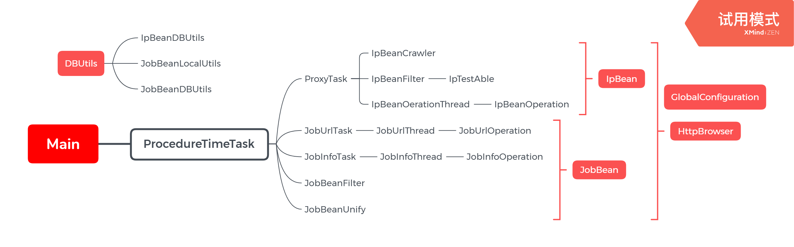

# Spider1.1详细设计文档
## 1.支撑环境  
>Java1.7+  
>UTF-8字符集  
>maven 3.6.1+  
>maven依赖
```
<dependencies>
        <!-- https://mvnrepository.com/artifact/mysql/mysql-connector-java -->
        <dependency>
            <groupId>mysql</groupId>
            <artifactId>mysql-connector-java</artifactId>
            <version>8.0.13</version>
        </dependency>
        <dependency>
            <groupId>junit</groupId>
            <artifactId>junit</artifactId>
            <version>3.8.1</version>
            <scope>test</scope>
        </dependency>

        <!-- https://mvnrepository.com/artifact/org.jsoup/jsoup -->
        <dependency> <groupId>org.jsoup</groupId>
            <artifactId>jsoup</artifactId>
            <version>1.8.3</version>
        </dependency>
        <dependency>
            <groupId>org.apache.httpcomponents</groupId>
            <artifactId>httpclient</artifactId>
            <version>4.5.10</version>
        </dependency>
    </dependencies>
```

## 2.类设计详情
