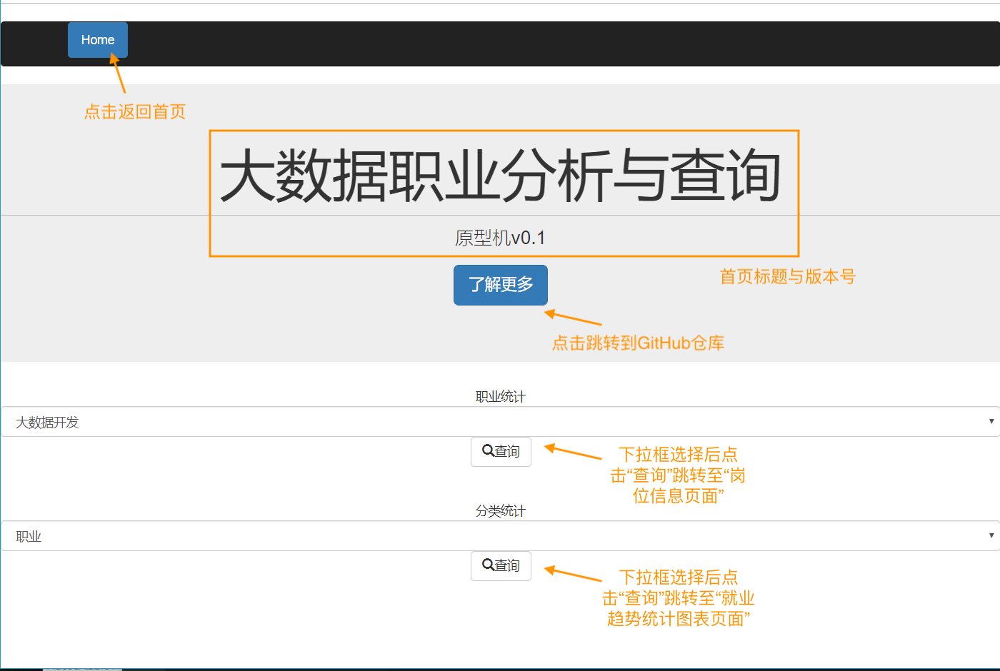
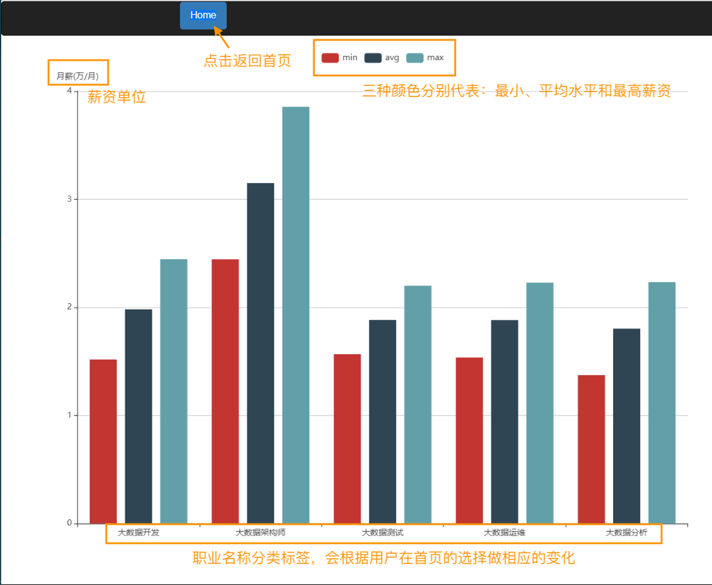

# "一个月完成项目"——前端开发文档
---

<!-- @import "[TOC]" {cmd="toc" depthFrom=1 depthTo=6 orderedList=false} -->

<!-- code_chunk_output -->

- ["一个月完成项目"——前端开发文档](#一个月完成项目前端开发文档)
  - [1. 前端概述](#1-前端概述)
  - [2. 概要设计](#2-概要设计)
  - [3. 前端模块设计](#3-前端模块设计)

<!-- /code_chunk_output -->

<!-- ## 1. 前言
1. 目的  
    &ensp; &ensp; 为了直观的向用户展示我们爬取的“**大数据+上海**”职业信息详情、后续的分析图表，并为用户提供简单交互式的浏览体验。前端开发团队设计开发三个前端界面为用户提供观览和操作，也将本项目的爬取和数据分析成果在PC浏览器网页端展示。  
    ​&ensp; &ensp; 本文档面向读者:  
    &ensp; &ensp; &ensp; &ensp; (1)设计人员  
    &ensp; &ensp; &ensp; &ensp; (2)开发人员  
    &ensp; &ensp; &ensp; &ensp; (3)部署维护人员

2. 背景  
    &ensp; &ensp; 现在的社会是一个高速发展的社会，科技发达，信息流通，人们之间的交流越来越密切，生活也越来越方便，大数据就是这个高科技时代的产物。紧跟时代的步伐，通过对广大学生提供相关职业的信息，为将来的职业发展做好提前的规划，并在执行项目的过程中，提高自己的能力。 -->


## 1. 前端概述  
1. 需求概述  
    &ensp; &ensp; 为用户开发一个可以进行交互式查询关于大数据职业信息的网站，并提供统计分析和职业能力匹配等服务。

2. 服务概述   
    + 网站首页信息展示，及用户点击下拉框选择关键字进行交互搜索操作；
    + 通过用户选择的岗位名称关键字，匹配热门招聘网站（51Job、智联招聘等）详细就业信息展示，并跳转提供链接；
    + 通过用户选择的就职条件关键字，匹配就业分析统计图表，直观展示就业趋势；

3. 对应用户  
    + 高中及以上的学历的在校学生；
    + 想了解上海市大数据方向就业趋势的；
    + 对上海市大数据方向有需求的求职人员；

4. 开发团队  
    前端：周婕、刘若尘、李翼

5. 测试环境  
    OS: Windows10 / MacOS
    Django: 2.1.1  
    ​MySql: 5.7.8  
    ​Python: 3.5.6  

## 2. 概要设计  
1. 前端流程设计  
    ```mermaid
        graph LR;
            A[大数据职业分析与查询网-首页]--搜索职业统计信息-->B[岗位信息页面];
            A--搜索就职条件-->C[就业趋势分类统计图表页面];
            B-.返回首页.->A;
            C-.返回首页.->A;
    ```
2. 前端业务逻辑
    + 大数据职业分析与查询网-首页
        + 界面示例展示  
            示例: 
        + 操作指南：
            &ensp; &ensp; &ensp; &ensp; 用户点击进入["大数据+上海"就业信息网-首页]，浏览首页展示网站基本信息；
            &ensp; &ensp; &ensp; &ensp; 在首页第一个下拉框内可选择“秃头程序员”、“暗黑运维人“、”痛苦架构师“，”大数据测试“和”大数据分析“五个选项，可任意选择一个然后点击“查询”，则进入[岗位信息页面]，查看所选职业的详细招聘信息;
            &ensp; &ensp; &ensp; &ensp; 在首页第二个下拉框内可选择“职业”、“教育背景“、”工作经验“，”公司类型“，“地区”和”公司领域“六个选项，可任意选择一个然后点击“查询”，则进入[就业趋势统计图表页面]，查看所选关键字影响下的就业趋势统计图表。

    + 岗位信息页面
        + 界面示例展示  
            示例: 
        + 操作指南：
            &ensp; &ensp; &ensp; &ensp; 查看所选职业的招聘信息总数和详细资料，包含职位名称、招聘公司和薪资待遇；
            &ensp; &ensp; &ensp; &ensp; 点击上方导航栏的“Home按钮即可返回首页；
            &ensp; &ensp; &ensp; &ensp; 点击下方数字列表可展现指定页码的职业信息。

    + 就业趋势统计图表页面
        + 界面示例展示  
            示例: 
        + 操作指南：
            &ensp; &ensp; &ensp; &ensp; 查看所选关键字影响下的就业趋势统计图表，点击上方导航栏的“Home”按钮即可返回首页。

## 3. 前端模块设计 
1. base.html
    + 界面名称：大数据职业分析与查询网-首页
    + 功能：浏览首页展示基本信息，用户可选择提交搜索表单任一到服务器；
    + 内部逻辑：
        ```mermaid
        graph LR;
            A[用户]--登陆-->B[base.html];
            B-.提交岗位信息表单.->C[服务器:get_jobinfo模块];
            B--跳转-->D[jobinfo.html];
            C-.岗位信息数据.->D;
            B-.提交职业/教育背景等关键字表单.->E[服务器:get_group_statistics模块];
            B--跳转-->F[stats.html];
            E-.统计图绘制数据.->F;
        ```
    + 实现方式：
        + Web 框架：Django
        + 前端框架：Bootstrap
    + 组件说明：
        + 导航栏组件：
            + 功能：返回首页按钮
            + URL：/base
            + HTTP请求方式：POST
            + 数据类型：json
            + 引入Bootstrap示例：
                ```html
                <link rel='stylesheet' href="/static/bootstrap-3.3.7-dist/css/bootstrap.min.css">
                ```
        + 岗位信息搜索组件：
            + 功能：提交分类统计关键字表单到服务器，并根据URL来提供特定的服务。
            + URL: /jobinfo
            + HTTP请求方式：POST
            + 数据类型：json
            + 表单提交示例：
                ```html
                <form  id ="1"  method="POST" class="form" >                    
                    
                    职业统计<br>               
                    <select name="jobs" id="jobs" class="form-control" >
                        <option value="大数据开发">大数据开发</option>
                        <option value="大数据运维">大数据运维</option>
                    </select>                 
                    <button type="submit" class="btn btn-default" onclick="Test()">
                            <span class="glyphicon glyphicon-search"></span>查询
                    </button>
                    
                </form>
                ```
        + 分类统计关键字搜索组件：
            + 功能：提交分类统计关键字表单到服务器，并根据URL来提供特定的服务。
            + URL: /stats
            + HTTP请求方式：POST
            + 数据类型：json
            + 表单提交示例：
                ```html
                <form action="stats" method="POST" class="option">
                    
                    分类统计<br>
                    <select name="option" class="form-control">
                        <option value="jobName">职业</option>
                        <option value="edu">教育背景</option>
                        <option value="exp">工作经验</option>
                        <option value="companyType">公司类型</option>
                        <option value="address">地区</option>
                        <option value="companyOrientation">公司领域</option>
                    </select>
              
                    <button type="submit" class="btn btn-default" >
                            <span class="glyphicon glyphicon-search"></span>查询
                    </button>
                    
                </form>
                ```


2. jobinfo.html 
    + 界面名称：岗位信息页面
    + 功能：解析服务器:get_jobinfo模块传来的数据查看所选职业的详细招聘数据，并将其展示到界面，点击左上角返回按钮即可返回首页。
    + 内部逻辑：
        ```mermaid
        graph LR;
            A[用户]--登陆-->B[base.html];
            B-.提交岗位信息表单.->C[服务器:get_jobinfo模块];
            B--跳转-->D[jobinfo.html];
            C-.解析岗位信息数据.->D;
            D[form.html]--返回-->B;
        ```
    + 实现方式：
        + Web 框架：Django
        + 前端框架：Bootstrap 
    + 组件说明：
        + 导航栏组件：
            + 功能：返回首页按钮
            + URL：/base
            + HTTP请求方式：POST
            + 数据类型：json
            + 引入Bootstrap示例：
                ```html
                <link rel='stylesheet' href="/static/bootstrap-3.3.7-dist/css/bootstrap.min.css">
                ```
        + 表格组件：
            + 功能：显示职业信息。
            + URL: /stats
            + HTTP请求方式：GET
            + 数据类型：json
            + 遍历展示职业信息示例：
                ```html
                    <h1 >{{ jobName }}共有{{ offers}}个offer</h1>
                    <div class="container">
                        <table class="table table-bordered">
                            <thead>
                                <tr>
                                    <th></th>
                                    <th></th>
                                    <th></th>
                                </tr>
                            </thead>
                            <tbody>
                                
                                <tr>
                                    <td>{{j.jobName}}</td>
                                    <td>{{j.company}}</td>
                                    <td>{{j.salary}}</td>
                                </tr>
                                
                            </tbody>
                        </table>
                        <nav aria-label="Page navigation">
                                <ul class="pagination">
                                <li>
                                    <a href="" aria-label="Previous">
                                    <span aria-hidden="true">&laquo;</span>
                                    </a>
                                </li>
                                
                                <li><a href="{{p}}">{{p}}</a></li>
                                
                                <li>
                                    <a href="" aria-label="Next">
                                    <span aria-hidden="true">&raquo;</span>
                                    </a>
                                </li>
                                </ul>
                            </nav>
                    </div>
                ```


3. stats.html 
    + 界面名称：就业趋势统计图表页面
    + 功能：解析服务器:get_group_statistics模块传来的数据，利用Echarts绘制用户所需统计图。查看所选关键字影响下的就业趋势统计图表，点击左上角返回按钮即可返回首页。
    + 内部逻辑：
        ```mermaid
        graph LR;
            A[用户]--登陆-->B[base.html];
            B-.提交职业/教育背景等关键字表单.->E[服务器:get_group_statistics模块];
            B--跳转-->F[stats.html];
            E-.解析统计图绘制数据.->F;
            F[stats.html]--返回-->B;
        ```
    + 实现方式：
        + Web 框架：Django
        + 前端框架：Bootstrap
        + 前端框架：Echarts 
    + 组件说明：
        + 导航栏组件：
            + 功能：返回首页按钮
            + URL：/base
            + HTTP请求方式：POST
            + 数据类型：json
            + 引入Bootstrap示例：
                ```html
                <link rel='stylesheet' href="/static/bootstrap-3.3.7-dist/css/bootstrap.min.css">
                <link rel="stylesheet" href="/static/bootstrap-select-1.13.9/dist/css/bootstrap-select.min.css"/>

                <script type="text/javascript" src="/static/jquery-3.4.1.min.js"></script>
                <script type="text/javascript" src="/static/bootstrap-3.3.7-dist/js/bootstrap.js"></script>
                <scirpt type="text/javascript" src="/static/bootstrap-select-1.13.9/dist/js/bootstrap-select.min.js" /></script>
                <scirpt type="text/javascript" src="/static/bootstrap-select-1.13.9/dist/js/i18n/defaults-*.min.js" /></script>
                ```
        + Echarts统计图组件：
            + 功能：解析数据，绘制统计图
            + URL：/base
            + HTTP请求方式：GET
            + 数据类型：json
            + 引入Echarts示例：
                ```html
                 <script  src="js/echarts.js"></script>
                ```
            + 解析数据+绘制统计图示例
                ```html
                <div id="main" style="height: 100%"></div>
                <script type="text/javascript" src= "/static/js/echarts/dist/echarts.min.js" ></script>
                <script type="text/javascript">

                    var dom = document.getElementById("main");
                    var myChart = echarts.init(dom);
                    var app = {};
                    option = null;    
                    var data={{ results | safe}};
                    var temp=data[0];
                    data[0]=['product', 'min', 'avg', 'max'];
                    data[data.length]=temp;
                    
                    option = {
                        legend: {},
                        tooltip: {},
                        dataset: {
                                source:data     
                        },
                        xAxis: {type: 'category'},
                        yAxis : [
                            {   name:"月薪(万/月)",
                                type : 'value',    
                            }],        
                        series: [
                            {type: 'bar'},
                            {type: 'bar'},
                            {type: 'bar'}
                        ]
                    };
                    // 使用刚指定的配置项和数据显示图表。
                    if (option && typeof option === "object") {
                        myChart.setOption(option, true);
                    }
                </script>
                ```


